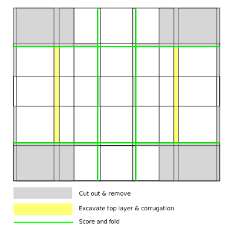

# CustomBox
How to use scrap cardboard to fold a custom box without a lid

I wanted custom-sized bins for miscellaneous parts that are stashed in plastic bags that measure 2"x3". I was inspired by [Itoshige Studio](https://www.youtube.com/watch?v=TuWWe0ORXug) and adapted the most basic techniques I noticed in the video linked.

I am storing my bins in a shoe box. Using the spreadsheet in this repo., you can adjust the numbers in the red box to automatically generate the grid for a box of a size of your choosing. I use millimeters, but you could choose any scale you like.

custom-box.ods is a LibreOffice Calc file. It might well work in Excel. 

# How I use this:

1. Start with a piece of scrap cardboard of sufficient size. Shipping and moving boxes make an excellent source. Don't worry about pre-existing creases too much, though I avoid cuts/holes in the cardboard.

2. Beginning from clean, straight edges, I draw straight lines vertically and horizontally corresponding to the distances in the black boxes on the spreadsheet.

3. I cut out the parts of the cardboard to be removed (shaded in gray in the illustration on the spreadsheet).

4. I excavate the top layer an interior corrugation (shaded in yellow in the illustration).

5. I score the green lines in the illustration.

6. Fold it together, inserting the tabs in the slots.

# Cutting / Folding Guide

